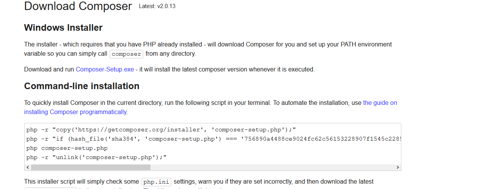
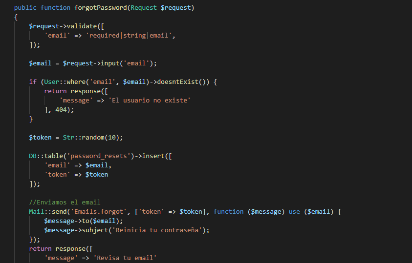
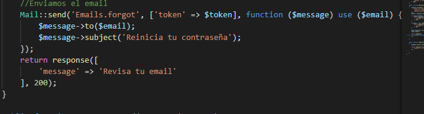
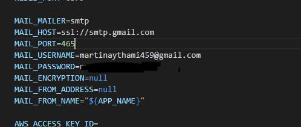
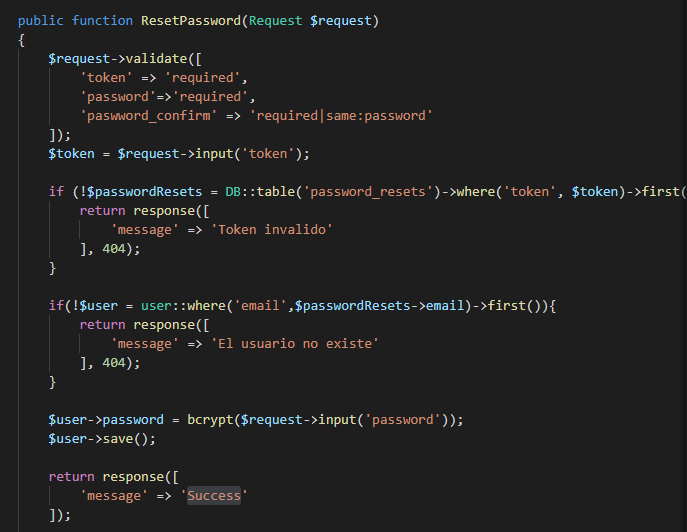
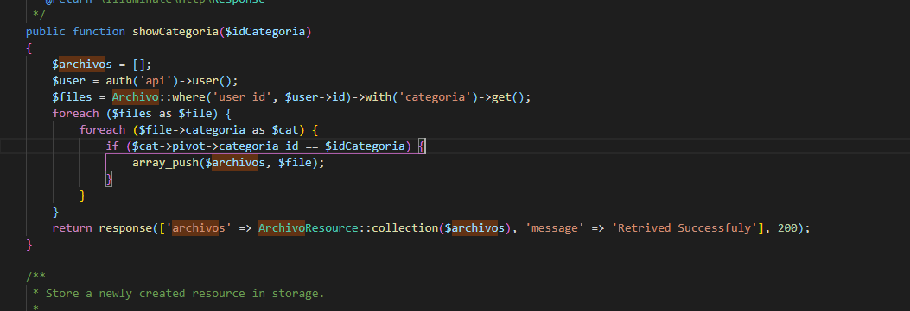
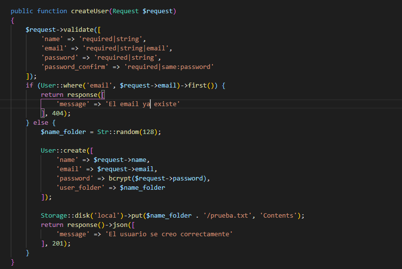
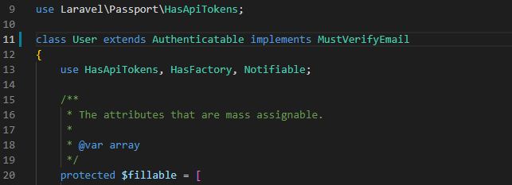
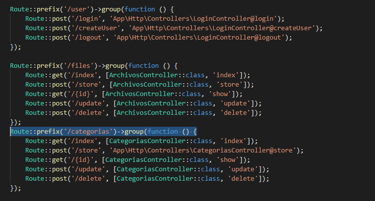

# Instalaciones
 
## Instalación de composer
 
Tenemos varias formas de instalar composer en windows una de ellas es descargando directamente el instalado o por consola de comandos,como vemos en la siguiente imagen.
 

 
Para linux lo instalamos de la siguiente manera primero nos movemos a la siguiente carpeta ` cd ~` lo descargamos
`curl -sS https://getcomposer.org/installer -o composer-setup.php` y lo instalamos de manera global para más comunidad a la hora de utilizarlo `sudo php composer-setup.php --install-dir=/usr/local/bin --filename=composer`
## Explicación de laravel 
¿Por qué utilizar laravel?
 
Laravel es bueno tanto para gente que está empezando a programar como para senior que llevan mucho tiempo en el negocio. En la web nos comentan que para los novatos su gran comunidad y la documentación , guías y  videotutoriales ayudan mucho utilizar el sistema.
 
En cuanto a desarrollador senior, laravel le brinda herramientas sólidas para la inyección de dependencias , pruebas unitarias , colas , eventos en tiempo real y más. 
 
También cuenta con un marco escalable, para ello tiene integrado un sistema de cache distribuido y rápido llamado Redis, también con Laravel vapor permite tener una escala ilimitada.
 
## Instalación de Laravel
 
Una vez instalado el composer, ya podemos crear nuestro back con el siguiente comando composer `create-project laravel/laravel servidor` esto instalará el proyecto.
Cuando acabe la instalación entramos en la carpeta donde esté instalado el servidor y lo lanzamos con el comando `php artisan serve`.
 
 
## Instalación de la extensión passport
 
Instalaremos también la extensión que nos permitirá gestionar las autentificación, para apis en laravel llamada passport con el comando composer `require laravel/passport` esperamos a que acabe la instalación, y ya podemos empezar a hacer la configuración esenciales para nuestro proyecto.
Lo primero es agregar nuestra base de datos en el proyecto para ello buscamos el archivo .env y agregamos el nombre de nuestra base de datos en caso de haber creado un usuario y contraseña también se lo ponemos.

 
# Primeros pasos después de la instalación
 
Ya con nuestra base de datos vinculada crearemos usaremos el siguiente comando para que laravel cree la tablas en la base de datos `php artisan migrate` ya con la base de datos lista podemos hacer `php artisan passport:install` para que nos genere las dos claves de nuestra api.
.
 
Empezamos con las configuraciones para passport primero nos vamos al nuestro modelo de users y agregamos las siguientes líneas `use Laravel\passport\HasApiTokens;` y `use HasApiTokens,HasFactory, Notifiable;`.
.
 
Ahora usamos nos vamos al archivo AuthServiceProvider y ponemos las siguientes lineas `use Laravel\passport\Passport;` `Passport::routes();`
 
.
 
También llevaremos un versionado de las distintas apis según vamos trabajando en ello, ya que esta es una buena práctica para la industria, llevaremos el siguiente formato, también se irá actualizando la siguiente tabla.
 
| Version | Funciones                                           | Fecha                 |
| ------- | --------------------------------------------------- | --------------------- |
| V1      | Creación de la api y login de usuarios con passport | 21/04/2021            |
| V2      | Gestion de usuarios y archivos documentos           | 21/04/2021-02/05/2021 |
| V3      | Gestión de categorias y usuarios                    | 02/05/2021-16/05/2021 |
 
para llevar este versionado a cambio modificaremos los siguientes archivos del RouterServiceProvider y ponemos la siguiente configuración.
 
.
 
y creamos esa estructura de carpetas en routes.
 
.
 
## Generamos las rutas de los usuarios
 
Para ello lo primero que vamos hacer es ir a la carpeta `v1/api.php` que comentamos antes. y agregamos comentamos la línea que contiene `Route::middleware` y procedemos a crear un prefijo para nuestros comandos de login. Y agregamos nuestra primera ruta a `/login` en nuestro controlador.
 
.
 
Ahora procedemos a crear nuestro contralor de con el siguiente comando `php artisan make:controller LoginController`.
 
.
 
En ese controlador primero importamos `use Illuminate\Http\Request;` y `use Illuminate\Support\Facades\Auth;`
Aprovechamos el Auth que nos proporciona laravel para comprobar si es correcto el login.
.
 
Debemos devolver un 422 o 401 que nos informa de que no está autentificado.
 
.
 
En caso de que pase el primer if creamos un token de acceso y se lo enviamos a como respuesta.
Para ello usamos otra clase de Auth que es user->createToken.
 
Con esto realizado volveremos a api para agregar un poquito mas de seguridad a nuestro controlador para ello generamos un middleware dentro del grupo de `/user` que use `auth:api` para proteger toda las rutas dentro del controlador que no tengan el token registrado.
 
.
 
Como medida de seguridad extra vamos a darle un tiempo de vida útil a nuestro token de acceso para ello nos vamos nuevamente a AuthServiceProvider y agregamos la siguiente función de passport
`Passport::personalAccessTokenExpireIn(now()->addHours(tiempo en horas));` en mi caso y para probar le he agregado 24 horas de validez al token.
 
.
 
## Migraciones con Laravel Y Eloquent.
 
Vamos a ver que el ORM que utiliza elocuent tiene diversas funciones que iremos explicando la primera de ellas es la posibilidad de guardar la base datos y todos sus cambios en el apartado de migraciones para ello procederemos a usar los siguiente comandos.
 
Para ello usaremos el siguiente comando `php artisan make:migration create_files_table` donde `files` es el nombre en plural de la tabla a utilizar, este siempre tiene que estar en minúscula.Nos generará el siguiente archivo.
 
.
 
Esta nos generará las siguientes 2 funciones dentro de la clase que hemos creado una Up que se encarga de crear las tablas en base de datos y una down que cuando acaba se encarga de borrar.
 

 
Nos centraremos en la función up que se encarga de crear las tablas en la base de datos viene ya por defecto con id y con un timestamp. y nosotros le hemos agregado los campos que necesitamos, otro dato interesante es que a la hora de agregar las claves foráneas usaremos foreign o foreinId en caso de usar id.
 

 
## Modelos con Laravel Y Eloquent.
 
Vamos a empezar a preparar nuestros modelos para ello usaremos el comando `php artisan make:model Files` donde files es el nombre que tendrá nuestro modelo, esto nos generará la siente clase.
 

 
Ahora agregamos el sofDetele que nos proporciona la función de que nuestras clases no se borren sino que se oculten para el usuario manteniendo así los datos en caso de perdida.
 

 
Empezamos a agregar los atributos para nuestras funciones con `$guarded` creamos campos protegidos en nuestro modelo en este caso es delete_at que sirve para que laravel guarde si han sido borrados los campos o no. `$filleable` ponemos los campos a los que queremos acceder, y con `$hidden` campos que quieres que estén ocultos cuando trabajas con los modelos como la contraseña.
 

 
## Relaciones en los modelos Eloquent.
 
Aquí veremos la relación uno muchos que encontramos en nuestro modelo usuario archivos donde un usuario pueden tener muchos archivos. Para ello nos vamos primero a user y ponemos la siguiente función `hasMany(Files::class)` y en Files ponemos lo siguiente `$this->belongsTo(User::class)` como se ven en las siguientes imágenes.
 

 

 
En esta ocasión tenemos una relación muchos a muchos entre categorías y archivos donde un archivo tiene muchas categorías y las categorías pertenecen a varios archivos. con `belongsToMany(Files::class)` en este caso usa la misma nomenclatura en los dos modelos, también en la documentación encontramos otra forma de hacerlo que es `return $this->belongsToMany(Role::class, 'role_user', 'user_id', 'role_id');` esta segunda opcion es si quieres ponerle un nombre diferente a la tabla intermedia.
 

 

 
## Controladores.
 
Empezamos a usar los controladores para ello vamos a usar el comando `php make:controler nombre --api` en el controlador aparecerán las siguientes funciones index, store , show, update y delete.
Index nos suele usar para enviar la información principal del modelo al que pertenece con un `::all` llamando al modelo, más adelante le iremos complicando la lógica.
 

 
Store nos permite almacenar los archivos que nos llegan de nuestra vista con `::create` podemos ir guardando todo lo que nos llega.Podemos devolver la respuesta y la información que se ha guardado de en la base de datos.
 

 
Show se usa para buscar un archivo en concreto en este caso usa la función `::find($id)` haciendo la búsqueda por id.
 

 
En el update primero vamos a validar los datos que nos están entrando por el request para que estos no vengan vacíos y luego procedemos a buscar el archivo que queremos lo modificamos y guardamos.
 

 
Delete es muy parecido al anterior lo que hacemos es buscar en la base de datos si existe en documento y si existe lo eliminamos aquí tienes dos opciones poner delete que va a hacer un soft delete y otra que es destroy que elimina el archivo completamente.
 

 
# Funcionalidades del backend
 
Aparte de lo básico que se va a usar en el código se han integrado aquí se van explicar cómo se han ido cambiado las cosas para obtener el buen funcionamiento de la aplicación.
 
## Manejando archivos.
 
Para manejar archivos vamos al store de nuestro controlador files y agregamos unas validaciones para ello usamos el validate de laravel y lo primero que vamos a hacer es que sea requerido, también podemos elegir el tipo de archivo de que puede aceptar con `require|image|max:2048` donde image es el tipo requerido y el max es el tamaño máximo del archivo en kilobytes. De momento voy a limitar las subidas de archivos a 500 megas ya que la aplicación es para guardar documentos, en caso de necesitar más espacio de subida se mirara a posteriori.
 

 
Ahora una vez el archivo validado vamos a ver como lo almacenamos en nuestra carpeta para ello voy a buscar al usuario en cuestión para guardarlo en su carpeta que ha sido previamente creada a la hora de insertar al usuario. Ya con el usuario conseguido guardamos el archivo en la carpeta correspondiente.
 

 
## Mejorando las respuestas de nuestro servidor
 
Ahora que ya vemos que responde correctamente nuestro servidor, vamos a mejorar la respuesta que nos da para ello acudimos a la funcionalidad de eloquent resource, para ello crearemos el resource de archivo que nos facilitara la conversiones en json para dar una respuesta más completa por parte de nuestro servidor. Primero usamos el comando `php artisan make:resource Archivo` y se genera la clase encargada de gestionar nuestro json.
 

 
a continuación vamos a mejorar la respuesta de nuestro controlador, `return response(['archivos'=>ArchivoResource::collection($files),'message'=>'Retrived Successfuly'],200);` con esta línea aplicamos el json de nuestros archivos que han sido buscador previamente, junto con un mensaje informando que noto a ido bien y un estatus 200.
 

 
También tenemos que poner la carpeta storage accesible para la web para ello usamos el siguiente comando `php artisan storage:link`.
 
## Contraseña olvidada
 
En este caso vamos a ver como creamos un envío de email con token de para recuperar contraseña que nos proporciona passport.
 

 
Para ello primero validamos que el email llegue relleno con la función validate, luego buscamos si existe en la base de datos si es así generamos un contraseña ramdon y la guardamos en la tabla password_resets, directamente ya que no tenemos un modelo para esa tabla.
 
El mail para ello tenemos que hacer uso de la función Mail de Laravel para ello las escribimos de la siguiente manera.
 

 
También tenemos que configurar los datos de nuestro servidor de email en este caso usaremos gmail de manera gratuita que nos permite 100 correos diarios.Para ello nos vamos a nuestro archivo emv.
 

 
## modificar contraseña
 
Esta función lo que nos permite es con el paso anterior de gestionar una contraseña con el enlace que se manda al correo recuperarla.
 

 
Para ello validamos el token que se te ha enviado al correo y las contraseñas introducidas.
Vemos si el token generado y el que está guardado en la tabla password_resets coinciden en ese caso pasamos a ver si el usuario existe y ya procedemos a guardar la nueva contraseña en el usuario.
 
## Distintos tipos de búsqueda
 
Aquí vamos a implementar un par de búsquedas extras aparte de la que vienen por "defecto", ya que no son tan comunes, entre ellas tenemos la búsqueda de archivos por categoría, después de darle una vuelta la forma más sencilla es filtrar el contenido de la siguiente manera .
 

 
Una búsqueda por fecha.
 
## Errores personalizados
 
Agregamos una respuesta 404 si es usuario ya existe con un mensaje de error personalizado.Como se ve en la siguiente imagen.
 

 
## verificación en dos pasos
Para implementar este método en la api me he regido por la documentación encontrada aqui https://dev.to/chandreshhere/laravel-email-verification-apis-246c la cual nos permite enviar un correo para verificar que este existe. Para ello realizaremos los siguiente cambios.
Primero implementamos la interfaz `MustVerifyEmail` en nuestro modelo user.
 

 
Después nos vamos a generar una nuevo controlador para gestionar estas dos páginas nuevas funciones una que recoja el email de verificacion y otra que envie el mail para ello usamos el comando `php artisan make:controller VerificationController` 
 
# Problemas
 
## Relación muchos a muchos
 
Uno de los mayores problemas a la hora de usar laravel ha sido que no me reconocían las relaciones muchos a muchos entre las relaciones porque laravel tiene definidas las relaciones que los modelos tienen que ir singular y las relaciones tablas en plural. Pasando de usar los nombres de los modelos de inglés a español al igual que las tablas para poder comprender el error bien. Ya que laravel coge los modelos y los campos de las tablas en singular y las tablas en plural y no reconoce las relaciones. También me ayuda el `php artisan tinker` que te permite ejecutar la funciones del controlador que quieres y ver los errores en la base de datos.
 
## Corrección de las rutas
 
Vamos a hacer unas correcciones a las rutas en la v3 por lo que no estaban funcionando bien para ello se le ha puesto un `Route::prefix('/categorias')->group(function ()` que nos permite poner todas las categorías dentro de un grupo, gracias a esto podemos acceder a través de `http://localhost:8000/api/v3/categorias/update` por ejemplo.
 

 
## Corrección en los controladores de categorías
 
Se a cambiado la forma de obtener los datos del usuario conectado `$user = auth()->user();` que nos proporciona el usuario cuando se usa la plantilla de laravel a este otro `$user = auth('api')->user();` que es el funciona con las api.

# Pruebas