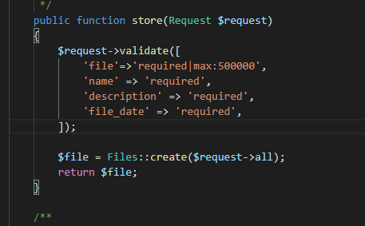

instalamos composer
 
 
 
# Instalación de Laravel 
Una vez instalado composer, ya podemos crear nuestro back con el siguiente comando composer `create-project laravel/laravel servidor` esto instalará el proyecto.
Cuando acabe  la instalación entramos en la carpeta donde esté instalado el servidor y lo lanzamos con el comando `php artisan serve`.
## Instalación de la extensión passport
 
Instalaremos también la extensión que nos permitirá gestionar las autentificación, para apis en laravel llamada passport con el comando composer `require laravel/passport` esperamos a que acabe la instalación, y ya podemos empezar a hacer la configuración esenciales para nuestro proyecto. 
Lo primero es agregar nuestra base de datos en el proyecto para ello buscamos el archivo .env y agregamos el nombre de nuestra base de datos en caso de haber creado un usuario y contraseña tambien se lo ponemos.

 
Ya con nuestra base de datos vinculada crearemos usaremos el siguiente comando para que laravel cree la tablas en la base de datos `php artisan migrate` ya con la base de datos lista podemos hacer `php artisan passport:install` para que nos genere las dos claves de nuestra api.
.
 
Empezamos con las configuraciones para passport primero nos vamos al nuestro modelo de users y agregamos las siguientes líneas `use Laravel\passport\HasApiTokens;` y `use HasApiTokens,HasFactory, Notifiable;`. 
.
 
Ahora usamos nos vamos al archivo AuthServiceProvider y ponemos las siguientes lineas `use Laravel\passport\Passport;` `Passport::routes();`
 
.
 
También llevaremos un versionado de las distintas apis según vamos trabajando en ello, ya que esta es una buena práctica para la industria, llevaremos el siguiente formato, también se ira actualizando la siguiente tabla.
 
| Version | Funciones | Fecha | 
| -- | -- | -- | 
| V1 | Creación de la api y login de usuarios con passport |21/04/2021 | 
| V2 | Gestion de  usuarios y archvios documentos  |21/04/2021-02/05/2021|
| V3 | Gestion de categorias y usuarios  |02/05/2021 - prograso|

 
para llevar este versionado a cambio modificaremos los siguientes archivos del RouterServiceProvider y ponemos la siguiente configuración.
 
.
 
y creamos esa estructura de carpetas en routes.
 
.
 
# Generamos las rutas de los usuarios
Para ello lo primero que vamos hacer es ir a la carpeta `v1/api.php` que comentamos  antes. y agregamos comentamos la línea que contiene `Route::middleware` y procedemos a crear un prefijo para nuestros comandos de login. Y agregamos nuestra primera ruta a `/login` en nuestro controlador.
 
.
 
Ahora procedemos a crear nuestro contralor de con el siguiente comando `php artisan make:controller LoginController`.
 
.
 
En ese controlador primero importamos  `use Illuminate\Http\Request;` y `use Illuminate\Support\Facades\Auth;` 
Aprovechamos el Auth que nos proporciona laravel para comprobar si es correcto el login.
.
 
Debemos devolver un 422 o 401 que nos informa de que no está autentificado.
 
.
 
En caso de que pase el primer if creamos un token de acceso y se lo enviamos a como respuesta.
Para ello usamos otra clase de Auth que es user->createToken.
 
Con esto realizado volveremos a api para agregar un poquito mas de seguridad a nuestro controlador para ello generamos un middleware dentro del grupo de `/user` que use `auth:api` para proteger toda las rutas dentro del controlador que no tengan el token registrado.
 
.
 
Como medida de seguridad extra vamos a darle un tiempo de vida útil a nuestro token de acceso para ello nos vamos nuevamente a AuthServiceProvider y agregamos la siguiente función de passport
`Passport::personalAccessTokenExpireIn(now()->addHours(tiempo en horas));` en mi caso y para probar le he agregado 24 horas de validez al token.
 
.
 
# Migraciones con Laravel Y Eloquent.
Vamos a ver que el ORM que utiliza elocuent tiene diversas funciones que iremos explicando la primera de ellas es la posibilidad de guardar la base datos y todos sus cambios en el apartado de migraciones para ello procederemos a usar los siguiente comandos.
 
Para ello usaremos el siguiente comando `php artisan make:migration create_files_table` donde `files` es el nombre en plural de la tabla a utilizar, este siempre tiene que estar en minúscula.Nos generara el siguiente archivo.
 
.
 
Esta nos generará las siguientes 2 funciones dentro de la clase que hemos creado  una Up que se encarga de  crear las tablas en base de datos y una down que cuando acaba se encarga de borrar.
 

 
Nos centraremos en la función up que se encarga de crear las tablas en la base de datos  viene ya por defecto con id y con un timestamp. y nosotros le hemos agregado los campos que necesitamos, otro dato interesante es que a la hora de agregar las claves foráneas usaremos foreign o foreinId en caso de usar id.
 

 
# Modelos con Laravel Y Eloquent.

Vamos  a empezar a preparar nuestros modelos para ello usaremos el comando `php artisan make:model Files` donde files es el nombre que tendra nuestro modelo, esto nos generare la siente clase.

Ahora agregamos el sofDetele que nos proporciona la funcion de que nuestras clases no se borren sino que se oculten para el usuario manteniendo asi los datos en caso de perdida.

Empezamos a gregar los atributos para nuestras funciones con `$guarded` creamos campos protegidos en nuestro modelo en este caso es delete_at que sirve para que laravel guarde si han sido borrados los campos o no. `$filleable` pornemos los campos a los que queremos acceder, y con `$hidden` campos que quieres que esten ocultos cuando trabajas con los modelos como la contraseña.

# Relaciones en los modelos Eloquent.
Aqui veremos la relacion uno muchos que encontramos en nestro modelo usuario archivos donde un usuario pueden tener muchos archivos. Para ello nos vamos primero a user y ponemos la siguiente funcion `hasMany(Files::class)` y en  Files ponemos lo siguiente `$this->belongsTo(User::class)` como se ven en la siguientes imganes.

En esta ocacion tenemos una relacion muchos a muchos entre categorias y archivos donde un archivo tiene muchas categorias y las cotegorias peternecen a varios archivos. con `belongsToMany(Files::class)` en este caso usa la misma  nomeclartura en los dos modelos, tambien en la documentacion encontramos otra forma de hacerlo que es `return $this->belongsToMany(Role::class, 'role_user', 'user_id', 'role_id');` esta segunda opcion es si quieres ponerle un nombre diferente a la tabla intermedia.  

 
# Controladores.
 
Empezamos a usar los controladores para ello vamos a usar el comando `php make:controler nombre --api` en el controlador aparecerán las  siguientes funciones index, store , show, update y delete. 
Index nos suele usar para enviar la información principal del modelo al que pertenece con un `::all` llamando al modelo, más adelante le iremos complicando la lógica.
 

 
Store nos permite almacenar los archivos que nos llegan de nuestra vista con `::create` podemos ir guardando todo lo que nos llega.Podemos devolver la respuesta y la información que se ha guardado de en la base de datos.
 

 
Show se usa para buscar un archivo en concreto en este caso usa la función `::find($id)` haciendo la búsqueda por id.
 

 
En el update primero vamos a validar los datos que nos están entrando por el request para que estos no vengan vacíos y luego procedemos a buscar el archivo que queremos lo modificamos y guardamos.
 

 
Delete es muy parecido al anterior lo que hacemos es buscar en la base de datos si existe en documento y si  existe lo eliminamos aquí tienes dos opciones poner delete que va a hacer un soft delete y otra que es destroy que elimina el archivo completamente.
 

 
 
# Manejando archivos.
 
Para manejar archivos vamos al store de nuestro controlador files y agregamos unas validaciones para ello  usamos el validate de laravel y lo primero que vamos a hacer es que sea requerido, también podemos elegir el tipo de archivo de que puede aceptar con `require|image|max:2048` donde image es el tipo requerido y el max es el tamaño máximo del archivo en kilobytes. De momento voy a limitar las subidas de archivos a 500 megas ya que la aplicación es para guardar documentos, en caso de necesitar más espacio de subida se mirara a posteriori.
 

 
Ahora una vez el archivo validado vamos a ver como lo almacenamos en nuestra carpeta para ello voy a buscar al usuario en cuestión para guardarlo en su carpeta que ha sido previamente creada a la hora de insertar al usuario. Ya con el usuario conseguido guardamos el archivo en la carpeta correspondiente.
 

# Mejorando las respuestas de neustro servidor
Ahora que ya vemos que responde correctamente nuestro servidor, vamos a mejorar la respuesta que nos da para ello acudimos a la funcionalidad de eloquent resource, para ello crearemos el resource de arvhivo que nos facilitara la conversiones en json para dar una respuesta mas completa por parte de nuestro servidor. Primero usamos el comando `php artisan make:resource Archivo` y se genera la clase encargada de gestionar nuestro json.

a  continuacion vamos a mejorar la respuesta de nuestro controlador,  `return response(['archivos'=>ArchivoResource::collection($files),'message'=>'Retrived Successfuly'],200);` con esta linea  aplicacmos el json de nuestros archivos que han sido buscador previamente, junto con un mensaje informando que noto a ido bien  y un estatus 200.

# Problemas
## Relacion muchos a muchos 
Uno de los mayores problemas a la hora de usar laravel a sido que no me reconocian las relaciones muchos a muchos entre las relaciones porque laracel tiene definidas las relaciones que los modelos tienen que ir singular y las relaciones  tablas en plural. Pasando de usar los nombres de los modelos de ingles a español al igual que las tablas para poder compender el error bien. Ya que laravel coge los modelos y los campos de las tablas en singular y las tablas en plurar y no reconoce las relaciones. Tambien me ayude de `php artisan tinker` que te rermite ejecutar la funciones del controlador que quieres y ver los errores en la base de datos.
