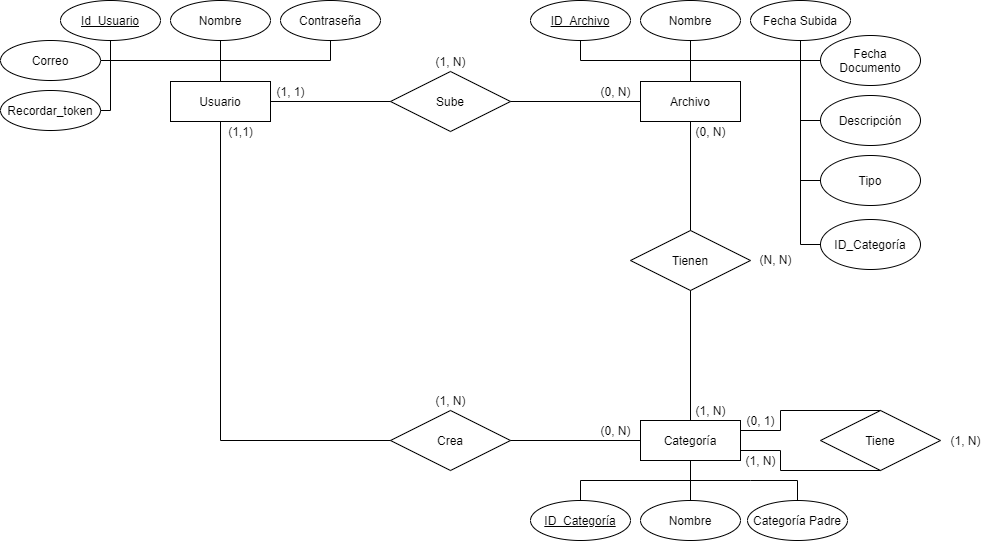
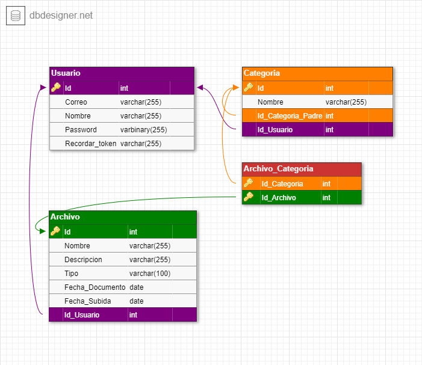

# Base de Datos

Para el proyecto estamos desarrollando un servicio web para el almacenamiento y organización de documentos. Diseñado para que el usuario pueda acceder rápidamente y desde cualquier lugar a su información.

- La web es multi-usuario y se almacenará de cada usuario un `id`, `correo`, `nombre` y `contraseña`.

- Cada usuario puede crear sus categorías para organizar los documentos. En las categorías almacenamos un `id` y `nombre`.

- Cada categoría es creada por un único usuario. Una categoría puede tener varias subcategorías.

- Los usuarios pueden subir archivos a la web. Cada archivo corresponde a un único usuario y se almacenará un `id`, `nombre`, `descripción`, `tipo de archivo`, `fecha del documento` y `fecha de subida`.

- Un documento puede estar relacionado con varias categorías.

## Modelo Entidad Relación

## Modelo Relacional

## [Script](BBDD/Organizador.sql)