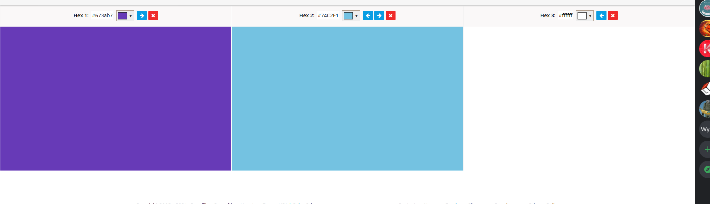
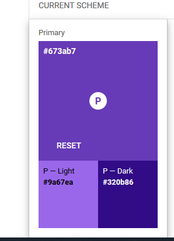
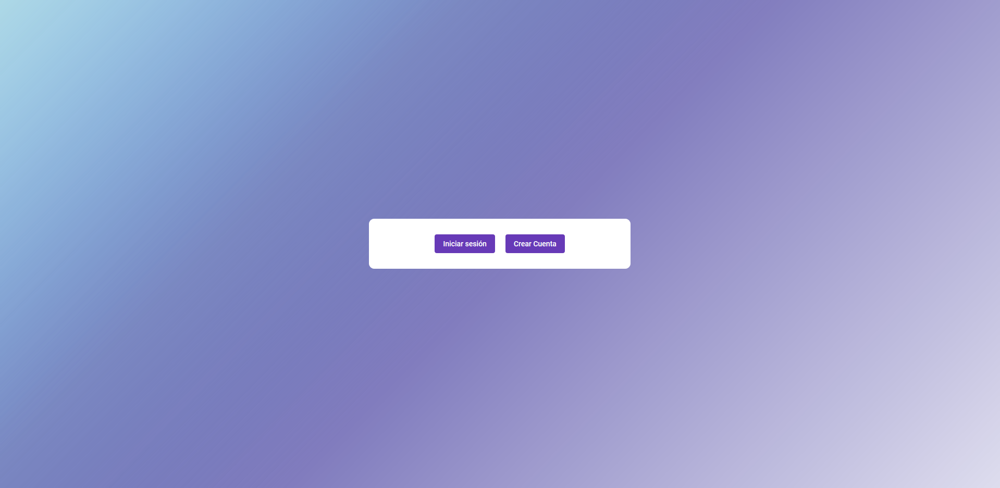
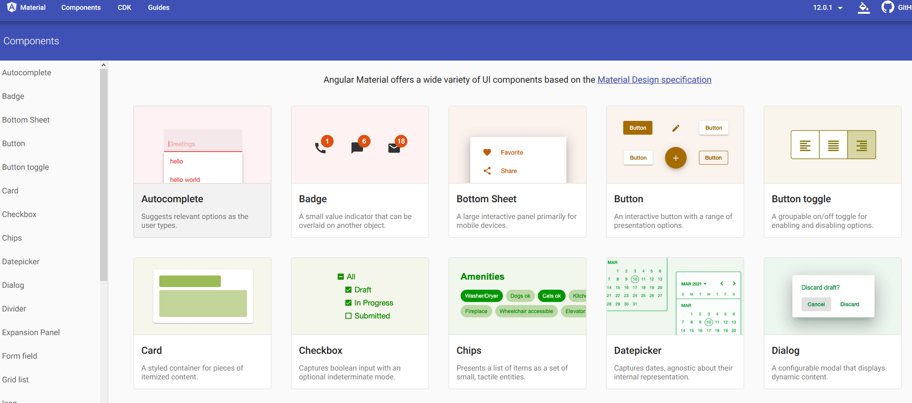
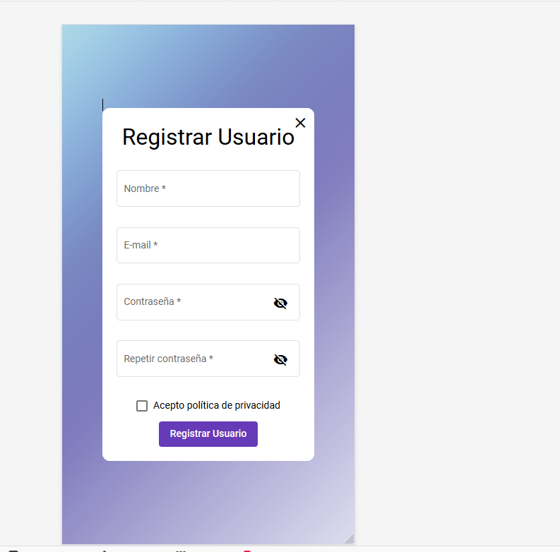

# Moqups
# Colores elegidos 
Los colores elegidos  para esta aplicación son el violeta , azul y blanco. Donde predomina el violeta y el blanco y dejando los distintos tonos de azul como fondo en un degradado.
 
El color principal es el #673ab7 seguido por el blanco #ffffff ya que ponemos nuestras vistas en carpetas para mejorar el diseño. 
 

 
El color morado tiene distintos tonos según donde se usa pero encontramos las siguiente combinación. Para oscurecer los botones al ser marcado.
 

 
 
El uso de estos colores están relacionados que al ser una aplicación para guardar documentos médicos hemos optado por usar colores  que usan las farmacéuticas donde muchas de ellas han optado por el todo violeta o azul.
 

 
 
El significado del color de cada uno de los elegidos.
 
* El blanco tienen  un significado de pureza , nobleza , transmite sobriedad y luminosidad en la industria farmacéutica está relacionado con la salud.
 
* El color azul simboliza la seguridad y la responsabilidad siendo este uno de los más usados en la industria farmacéutica.
 
* El color violeta es usado para la meditación, contemplación y espiritualidad.  También se le asocian  a la tristeza, el luto y el mundo del dolor (por los morados) aportando un poco a una aplicación médica.
 
Por último poner un ejemplo de nuestra web para que se vean todo lo comentado anteriormente.
 
 

 
# Estilo de diseño
 
En cuanto a diseño hemos decidido utilizar los componentes que nos ofrece Angular Material.
 

 
Este nos aporta una gran cantidad de componentes  con un estilo muy característico de Material Design.
 
Material design es una normativa de diseño enfocado en la visualización del sistema operativo Android, además en la web y en cualquier plataforma. 
 
El diseñador Matías Duarte explicó que, "a diferencia del papel verdadero, nuestro material digital puede ampliar y reformar de forma inteligente. El material tiene superficies físicas y bordes. Las texturas y las sombras que tengan sentido de lo que se puede tocar." 
 
En principio como la aplicación está basada en Angularjs y Ionic nos pareció un buen estilo de diseño para utilizar como se ven el la siguiente imagen.
 

 

