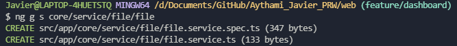
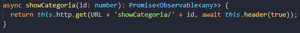
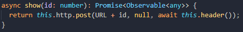

# Instalación de Ionic
## Instalar Ionic CLI
Para poder instalar [Ionic CLI](https://ionicframework.com/) debemos comprobar que tenemos instalado [Node.js](https://nodejs.org/es/). Una vez comprobado instalamos **Ionic cli** con `npm`:

~~~
npm install -g @ionic/cli
~~~

Si tenemos una instalación previa, deberá desinstalarse debido a un cambio en el nombre del paquete.

~~~
npm uninstall -g ionic
npm install -g @ionic/cli
~~~

## Crear una aplicación
Para crear una aplicación en ionic utilizaremos la plantilla en blanco `blank`. También existen plantillas prefabricadas con un menú lateral `sidemenu` o con un iniciador de pestañas `tabs`. Para la creación utilizaremos `ionic start`.

~~~
ionic start web blank
~~~

Una vez lanzado el comando nos mostrará una lista de frameworks para utilizar con **Ionic**. En nuestro caso utilizaremos **Angular**.

Otra pregunta en la instalación es si queremos integrar `Capacitor`, que es un puente de **Ionic** hacia lo nativo, permitiendo acceder a los recursos nativos de los dispositivos, permitiendo una comunicación sencilla.

## Lanzar aplicación
Para lanzar la aplicación de **Ionic** debemos situarnos en la raíz de la aplicación y ejecutar el comando `ionic serve`.

~~~
cd web
ionic serve
~~~

# Dependencias

Las dependencias utilizadas en el proyecto son:

- Material

    Es una librería de guías de estilos creada por Google. Utilizada principalmente en los formularios de la aplicación. Instalación:

    ~~~
    ng add @angular/material
    ~~~

    En este proceso nos preguntará el tema que vamos a utilizar que en nuestro caso es `Deep Purple/Amber`, si queremos la tipografía `yes` y por último que si queremos las animaciones `yes`.

    

- Ionic Storage

    Es un módulo para el almacenamiento de valor clave simple para las aplicaciones hechas con ionic, pudiendo ser utilizada en web como en los dispositivos móviles, facilitando el proceso de traspaso a android e ios. Instalación:

    ~~~
    npm install @ionic/storage-angular
    ~~~

    

    En la instalación surgió una vulnerabilidad grave. Para corregirlo utilice un comando que recorre las dependencias e intenta corregir el error

    ~~~
    npm audit fix --force
    ~~~

    

- DropZone

    Dropzone es una dependencia que nos permite el poder arrastrar los archivos y soltarlos dentro de la app, facilitando al usuario la selección de los archivos. Instalación:

    ~~~
    npm install --save ngx-dropzone
    ~~~

    

# Organización del proyecto
## Core

En el directorio **app/core** estarán los `servicios`, las `directivas` y los `guard` que utilizara la aplicación.

- ### Servicios

    Un servicio trabaja de manera síncrona con datos y llamadas. Para crear un servicio utilizaremos el siguiente comando:

    ~~~
    ng generate service [Nombre del Servicio]

    // Reducido
    ng g s [Nombre del Servicio]
    ~~~

    Actualmente disponemos de 4 servicios:
    
    - auth

        

        El `authService` se encarga de la autenticación de usuarios, mandando peticiones a la API

        - Iniciar sesión

            

        - Registro

            

        - Olvido de contraseña

            

        - Resetear contraseña

            

        - Cerrar sesión

            

    - storage
        
        

        El `storageService` se encarga de almacenar y gestionar los datos del usuario guardados en **ionic storage**

        - Crear Almacenamiento

            
        
        - Guardar Token

            
            
        - Guardar Usuario
            
            
            
        - Recoger Token
            
            

        - Recoger Usiario
            
            

        - Comprobar si existe un Token

            
        
        - Limpiar Almacenamiento

            
            
    - file

        

        El `fileService` se encarga del almacenamiento y control de archivos, mandando peticiones a la API. En la cabecera de estas peticiones se envía el token del usuario, sino el servidor nos devolverá un error al no identificar al usuario.

        

        - Recoger todos los archivos del usuario
            
            

        - Subir un archivo
            
            

        - Editar un archivo
            
            

        - Recoger los datos de un archivo
            
            

        - Descargar el archivo
            
            

        - Mostrar todos los archivos de una categoria

            

        - Eliminar un archivo
            
            

    - cetegoria

        El `categoriaService` se encarga del almacenamiento y control de las categorías, mandando peticiones a la API. En la cabecera de estas peticiones se envía el token del usuario, sino el servidor nos devolverá un error al no identificar al usuario.

        

        - Recoger todas las categorías del usuario
            
            
        
        - Crear categoría
            
            

        - Editar categoría
            
            

        - Recoger los datos de una categoría

            

        - Eliminar categoría
            
            

- ### Directiva

    Una directiva es una serie de elementos que aplicaremos a nuestro código HTML como si de un atributo se tratara con el fin de añadir una nueva funcionalidad

    ~~~
    ng generate directive [Nombre de la Directiva]
    ~~~

    - password-equal-validator

        Se encarga de comprobar en tiempo real que las dos contraseñas que se introducen en los formularios de `resetPassword` y `register` sean iguales. En el caso que no sean iguales se creará un `ValidatorError`

        

- ### Guard

    Un guard es un middlewares que se ejecutan antes de cargar una ruta y determinan si se puede cargar dicha ruta o no.

    ~~~
    ng generate guard [Nombre del Guard]
    ~~~

    - auth

        Con la función canActive comprobamos si el usuario está logueado. De lo contrario no podrá acceder
        
        

## Views

En el directorio **app/views** estarán todas las vistas de la aplicación. Dentro de este directorio encontramos la `app` donde se inicializa la aplicación.

~~~
// Crear Modulo
ng generate module [Nombre del Modulo]
ng g m [Nombre del Modulo]

// Crear Routing
ng generate module [Nombre del Modulo]-routing --flat --module=[Nombre del Modulo]
ng g m [Nombre del Modulo]-routing --flat --module=[Nombre del Modulo]

// Crear Componente
ng generate component [Nombre del Componente]
ng g c [Nombre del Componente]
~~~

- ### Auth

    En el directorio **app/views/auth** encontramos las vistas encargadas de la creación y control de los usuarios, donde podemos crear una cuenta, iniciar sesión, recuperar cuenta y resetear la contraseña

    

- ### Dashboard

    En el directorio **app/views/dashboard** encontramos todas las vistas de la ejecucion principal de la aplicación. Para poder acceder a estas vistas debemos iniciar sesión, sino el guard no redirige al login

    

# Problemas
## Implementación de la plantilla Metronic Demo1

Tanto mi compañero como yo nos habíamos puesto de acuerdo y decidimos que íbamos a implementar la plantilla [Metronic Demo1 de Angular](https://preview.keenthemes.com/metronic/angular/demo1/dashboard) que nos parecía muy adecuada con el diseño que habíamos presentado en el anteproyecto. 

Cuando empece a implementar, me comenzó a aparecer muchos errores en distintos sitios y a su misma vez quería también añadir algunas funciones que a la hora de intentar añadirlas en el proyecto me daba muchos conflictos con las dependencias de la propia plantilla.

Por todo estos errores y problemas que me han surgido y que hemos intentado arreglar, he perdido 3 semanas, viendo que se aproximaba la fecha de entrega y que no habíamos terminado de arreglar los fallos que se producían, hemos decidido empezar a utilizar **Ionic** para poder seguir con el desarrollo del proyecto.

## Promesas

Ha sido un poco confuso la utilización de las promesas. Durante el curso no llegamos a verla, su utilización dentro del proyecto ha sido complicada y hemos tenido que utilizar bastante tiempo en contemplar su funcionamiento.

## Descarga de los archivos

Otro problema que nos surgió fue a la hora de descargar los archivos, ya que nos saltaba un error de cabecera, error que era un poco confuso pues nos informaba que nos faltaba el `token` pero sabíamos que esto no podía ser así ya que el envío del `token` había sido utilizado anteriormente en el resto de servicios.