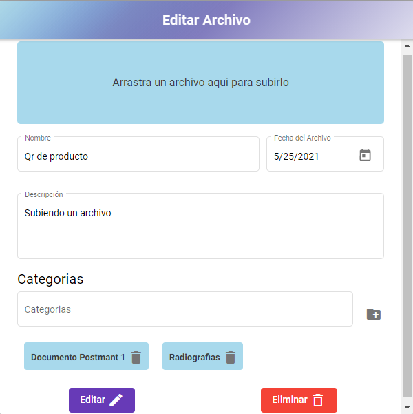

# Manual de uso de la aplicación.
Aquí se va a explicar lo necesario para usar la aplicación.
## Login registro y recuperación de contraseña.
Los primeros  que nos vamos a encontrar a la hora de entrar en nuestra página web es la siguiente vista que nos permite iniciar sesión  o registrarte.
 

 
Como se ve se muestran dos opciones una que nos permite crear una cuenta y otra que nos permite iniciar sesión.
 
Primero veremos el registro de usuarios encontramos que nos piden la siguiente información, Nombre , email , contraseña y repetir contraseña.
 
También pedimos que se acepten las políticas de privacidad, en caso de no aceptarlas no se podrán registrar en la web ya que se está trabajando con documentos que pueden llegar a ser sensibles.
 

 
Una vez con los datos rellenos, podemos ver que si escribimos algo mal nos mostrará un mensaje.
 

 
Tarda un momento en enviarse el correo al email y nos redirige al login.
 

 
 
En el correo también nos encontramos con el siguiente correo el cual tenemos que activar.
 

 
Donde dando click en el botón, nos verifica el correo y redireccionará a el login. También contamos con la opción de validar contraseña para ello le damos al link en azul debajo del login.
 
Una vez aquí nos pedirá el email  si lo envias sin que el email este en el sistema dara un error.
 

 
Una vez enviado le das a enviar se mostrará el siguiente mensaje 
 

 
En el email encontramos el siguiente email de momento aparece como inseguro por como está diseñado el correo. Pero funciona bien.
 

 
Nos llevará a una nueva ventana de recuperar contraseña
 

 
Una vez realizado el cambio volverás al login.
 
 
## Menú principal
 
Así se ve nuestro menú principal donde se muestran los archivos subidos, por categorías y una  página principal donde se muestran todos los archivos.
 

 
## Gestión de archivos
 
Para añadir un archivo nuevo le damos al botón añadir archivo y se desplegará el siguiente modal.
  

 
Como se ve en la siguiente imagen las categorías se muestran en un el campo y se añaden dándole al símbolo de la derecha con la carpeta agregar esto permite añadir al archivo a las categorías.
 

 
Si haces click en arrastrar un archivo nos la carpeta para gestionar el archivo, también se puede arrastrar directamente como dice la frase.
 

 
Aquí se muestra un archivo completamente relleno.
 

 
Editar funciona exactamente igual teniendo que darle  a editar en la tarjeta del archivo
 

 
Mostrando los datos del archivo anteriormente subido.
 

 
## Gestión de categorías
 
Para crear una categoría nos vamos al lado izquierdo de la aplicación y tocamos el botón crear Categoría. Veremos el siguiente modal en el cual añadimos nombre y la categoría padre a la que pertenece.
 

 
Si hacemos click en la categoría, veremos los archivos dentro de estas categorías.
 

 
Como vemos podemos ir creando subcategorías para gestionar mejor nuestros archivos. Pudiendo gestionar mejor los archivos.
 

 
 
 
