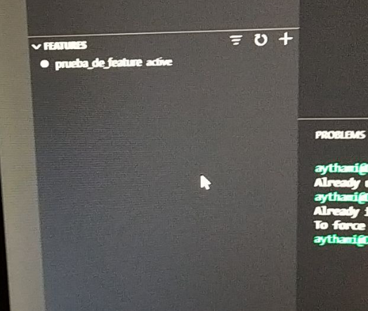
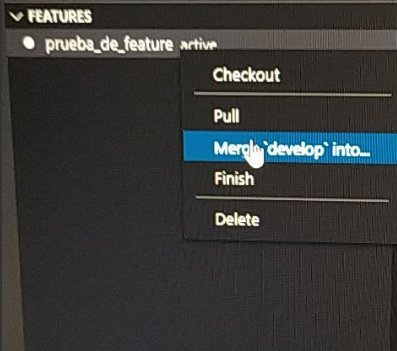
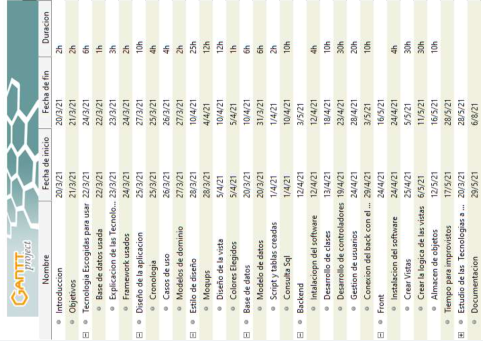
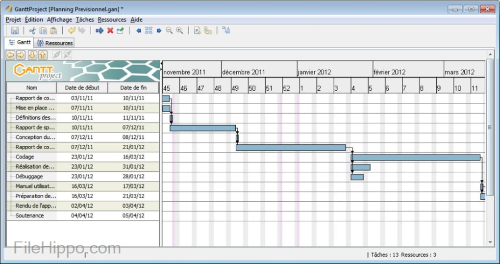

 
# Explicación de las tecnologías

## Git

Gracias a git contamos con las siguientes características que nos ayudan a mejorar nuestro forma de programar.Para ello nos ofrece las siguientes ventajas:
- Sistema de versiones, que nos permite llevar un gestión de los cambios realizados en nuestros códigos.
- Nos permite trabajar en equipo de manera sencilla. Gracias a un sistema de Merges.
- También nos permite volver a las versiones anteriores de nuestro código.
 
Para usar git nos vamos a su página web y nos descargamos el archivo de instalación que encontramos para windows.
 

 
En caso de usar Linux  podemos instalarlo con los siguientes comandos 
`Sudo apt install git ` o `sudo pacman install git`. En Mac `yum install git`
 
## Git-Flow

En cuanto a git flow es un agregado extra a las funciones git , nos mejora el flujo de trabajo.Para ello creamos una serie de ramas extras que nos permitirán mejorar la gestión de nuestros proyectos y no pisarnos el trabajo entre varias personas.Para ello cogemos la siguiente forma de actuar:
- Master y develop son intocables.
3 ramas nuevas de trabajo feature , hotfix y release.    
- Explicaré el funcionamiento de estas ramas.
- Feature es una copia de develop, cómo no se trabaja directamente con esta da mas estabilidad a nuestro código. Cuando se termina una feature esta ser mergea al develop. Pudiendo volver a una versión anterior de manera mucho más sencilla.
- Release es la copia de develop que se va a pasar a producción donde se pueden testear posibles fallos de las mismas. y es el que lleva con sigo los cambios de versiones.
- Hotfix es una copia de master que sirve para arreglar los errores.
 
A la hora de usar gitflow primero necesitamos instalarlo para ello usaremos el comando `Sudo apt install git-flow ` o en caso de window su instalador correspondiente.
para usar gitflow de manera comoda sin comandos, tambien nos descagaremos esta extension del  [visual estudio code](https://marketplace.visualstudio.com/items?itemName=PsykoSoldi3r.vscode-git-flow).
 

 
###### Funcionamiento

 Lo primero para hacer uso de gitflow pondremos el comando `git flow init` en nuestra carpeta principal para agregarle las funciones de git flow a nuestro proyecto.
 
 Ahora en nuestro plugin de gitflow de daremos al + que se ve en features  esto nos permitirá crear una copia de developer de forma sencilla.
 

 
Trabajaremos en esta rama hasta terminar nuestro trabajo peticion o funcion y luego usaremos el botón que pone merge. 
 

 
Podemos cerrar la rama en finish para no acumular muchas ramas de features. 
 

 
Podemos crear la rama con el comando `git flow feature start feature_branch`
que es una copia de develop y `git flow feature finish feature_branch`  que cierra la rama y la mergea automáticamente.
 
## Trello

Trello es una herramienta que nos permite gestionar los trabajos que realizan cada uno de los integrantes del grupo.
Para ello nos proporciona un tablero como se ve en la siguiente imagen.

Dando la capacidad de poner comentarios, hacer listas de tareas e ir cambiando la tarea según va avanzando en nuestro caso hemos puesto 4

## Diagrama de Gannt 

El diagrama de gantt es una forma útil de gestión que tiene que completarse en un proyecto y sus fechas.

como vemos en la imagen  El diagrama de gantt cuenta con un nombre para las tareas, fecha de inicio , fecha de fin y tiempo para realizar las tareas. Estos elementos puesto como se ven en la imagen nos proporcionan las duración estimada del proyecto. Cuánto tiempo y en qué fechas se deben entregar cada una de las tareas del mismo.

Usar estos diagramas nos aporta claridad en el proyecto, una vista general del mismo, datos sobre el rendimiento , mejor gestión del tiempo y flexibilidad.

###### Claridad

Nos aporta claridad gracias a ver las tareas desglosadas y las líneas temporales en una sola vista del proyecto.

###### Comunicación

Esto ayuda a las diferentes partes del equipo a llevar un tiempo de entrega, reduciendo las reuniones.

###### Motivación

Al tener unos tiempos de entrega tan marcados se motivan a entregar el trabajo para no retrasar el resto del proyecto. 

###### Flexibilidad

Los programas  nos permiten editar el tiempo y las horas de trabajo para ajustar el tiempo de entrega ya que estos suelen variar según las circunstancias.

El programa usado en esta ocasión para hacer el diagrama es Ganttproject https://www.ganttproject.biz/ aprobenchando que es de libre uso. 
Como se ve en la imagen tenemos la opción de crear el proyecto con nombre , fecha inicio y fecha fin.

 El programa nos permite agregar nuevas éticas y hacer subTareas. Entonces agregue duración y  para tener en cuenta cuánto deben durar las tareas 

# Usos de las Tecnologías en nuestro proyecto y otros datos de interés.
 
#### Como hacer los commit 
 
En nuestro caso hemos decidido hacer los commit de la siguiente manera 'información de lo que has realizado fecha y duración ' quedando de la siguiente manera los commit 'Bibliografía y bitacora actualizada  04/04/2021 5min'

# Base de datos usada

La base de datos que hemos decidido usar es Mysql o Mariadb.
Para esta elección hemos tenido en cuenta las bases de datos que puede usar nuestro framework de backend que son:
- MySQL
- Postgresql
- SQLite3
- SQL Server
 
Luego hemos tenido en cuenta la experiencia usando las distintas bases de datos  nombradas anteriormente, las dos que hemos usado más son Mysql y Sqlite.
 
 En cuanto a sqlite está diseñada para funcionar en memoria o con dispositivos móviles. 
 
Mysql está más diseñada para páginas web con un servidor integrado, también es una de las que más hemos usado y viene instalada junto con Xampp que será nuestro software de desarrollo.
 
Las otras bases de datos no las hemos tratado en el instituto y están orientadas a grandes flujos de datos.
 
# Framework

 En cuanto a framework este año no hemos visto muchos framework en el front hemos visto Angular y en el back apenas hemos llegado a ver laravel y sinfonía en la parte de php y Spring en la parte de java(Gracias a la documentación de JC).
 
 Otro de los hándicap a tomar en cuenta ha sido la dificultad de los integrantes del grupo a la hora de programas en una u otro lenguaje de programación y el lenguaje que se está usando en la prácticas de ambos para poder tener un poco de ayuda en caso de necesitarla.
 
 Por ello hemos elegido en el front Angular ya que es el lenguaje que está usando Javier en el front y Laravel por la documentación y que Aythami está usando otro framework muy parecido de back en la empresa de practicas llamado CodeIgniter 3. 

 
