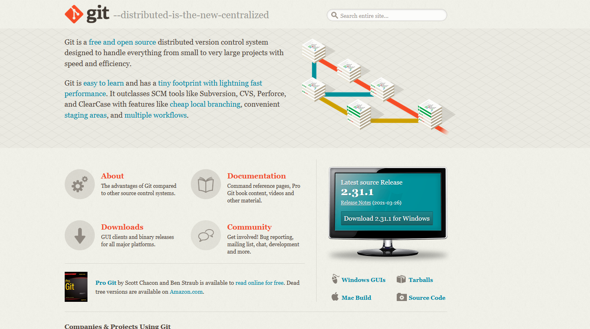
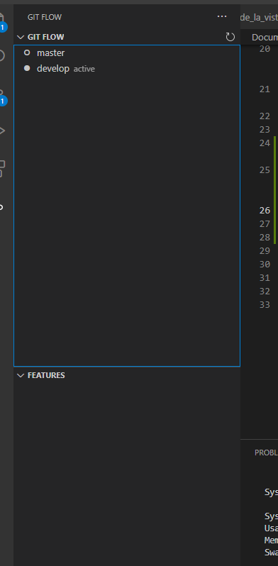
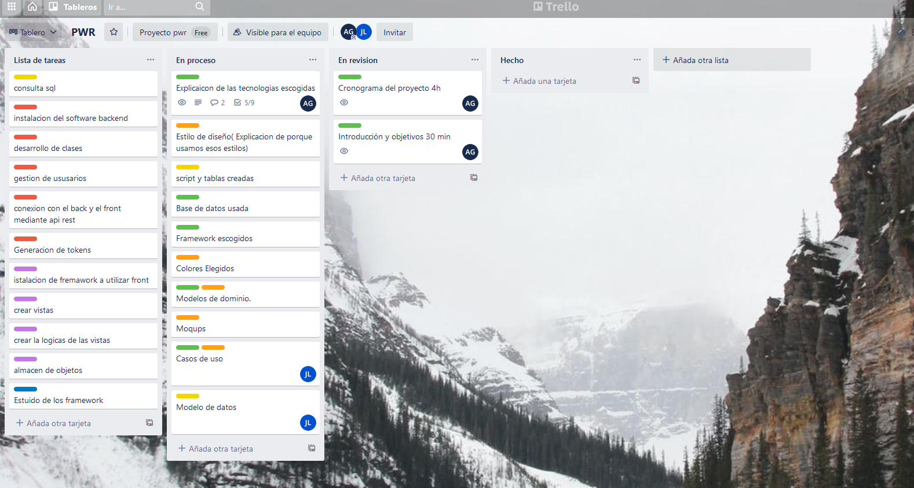

# Explicación de las tecnologías
## Git
Gracias a git contamos con las siguientes características que nos ayudan a mejorar nuestro forma de programar.Para ello nos ofrece las siguientes ventajas:
- Sistema de versiones, que nos permite llevar un gestión de los cambios realizados en nuestros códigos.
- Nos permite trabajar en equipo de manera sencilla. Gracias a un sistema de Merges.
- También nos permite volver a las versiones anteriores de nuestro código.

Para usar git nos vamos a su página web y nos descargamos el archivo de instalación que encontramos para windows.

En caso de usar Linux  podemos instalarlo con los siguientes comandos 
`Sudo apt install git ` o `sudo pacman install git`. En Mac `yum install git`

## Git-Flow
En cuanto a git flow es un agregado extra a las funciones git , nos mejora el flujo de trabajo.Para ello creamos una serie de ramas extras que nos permitirán mejorar la gestión de nuestros proyectos y no pisarnos el trabajo entre varias personas.Para ello cogemos la siguiente forma de actuar:
- Master y develop son intocables.
3 ramas nuevas de trabajo feature , hotfix y release.    
- Explicaré el funcionamiento de estas ramas.
- Feature es una copia de develop, cómo no se trabaja directamente con esta da mas estabilidad a nuestro código. Cuando se termina una feature esta ser mergea al develop. Pudiendo volver a una versión anterior de manera mucho más sencilla.
- Release es la copia de develop que se va a pasar a producción donde se pueden testear posibles fallos de las mismas. y es el que lleva con sigo los cambios de versiones.
- Hotfix es una copia de master que sirve para arreglar los errores.

A la hora de usar gitflow primero necesitamos intalarlo para ello usaremos el comando `Sudo apt install git-flow ` o en caso de window su instalador correspondiente.
para usar gitflow de manera comoda sin comandos, tambien nos descagaremos esta extension del  [visual estudio code](https://marketplace.visualstudio.com/items?itemName=PsykoSoldi3r.vscode-git-flow).

## Trello
Trello es una herramienta que nos permite gestionar los trabajos que realizan cada uno de los intengrantes del grupo.
Para ello nos proprociona un tablero como se ve en la siguiente imagen.

Dandono la capacidad de poner comentarios, hacer listas de tareas e ir cambiando la tarea segun va avanzando en nuestro caso hemos puesto 4
# Base de datos usada
# Framework
